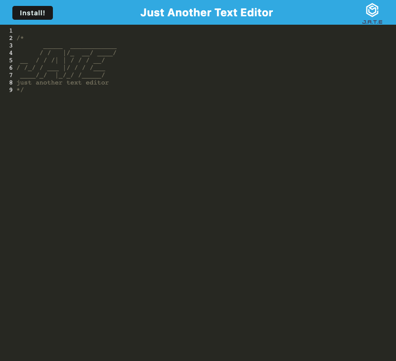

# PWA-text-editor
'Just Another Text Editor' (or J.A.T.E.) is a single-page PWA that offers installation and offline usability. To accomplish this, I utilized IndexedDB as well as webpack.js and CodeMirror. User input is stored and fetched using Local Storage as well as IndexedDB when the user's focus moves away from the editor's browser. The implemented service worker and manifest allows for asset cacheing and creates an application that is fully functional while offline. This technique coupled with the storage capablity of IndexedDB and Local Storage ensures that user-entered-text will be saved regardless of network strength.

## Visit the App
### URL
Visit [J.A.T.E.](https://jate-pwa-2023-433da1eb4458.herokuapp.com/)
### Screenshot

## Usage

- Follow the [link](https://jate-pwa-2023-433da1eb4458.herokuapp.com/) to view the app in your browser
- Enter or delete text in the editor. When the window loses focus, any text in the editor will be saved and persist upon page reload
- To install the application, click the install button in the upper left corner of the page. Follow the browser's prompts to install J.A.T.E. on your local machine. Data previously saved in browser applicaton will persist to the installed application.

## Resources 
[IndexedDB API](https://developer.mozilla.org/en-US/docs/Web/API/IndexedDB_API)

[Webpack.js](https://webpack.js.org/)

[CodeMirror](https://codemirror.net/)

